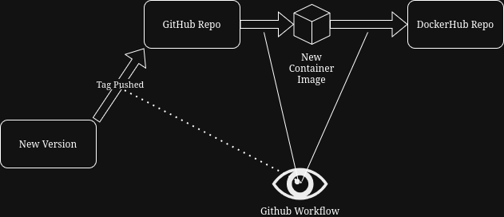

The goal of this project is to configure github actions to perform automated deployment to a DockerHub repo whenever new versions of the container image are ready.

1.  
    The content of the site is extremely simple, just an index page with a link to a second page, which links back to the index page.

    [Site Content](https://github.com/WSU-kduncan/cicdf25-kairoundmountain/tree/main/web-content)
    
    The dockerfile is also very simple, it just specifies to use the httpd version 2.4 image, to copy the contents of the web-content directory into the correct folder so it will be hosted, and to expose port 80.
    
    [Dockerfile](https://github.com/WSU-kduncan/cicdf25-kairoundmountain/blob/main/Dockerfile)

    To build the docker container, simply run `docker build -t kairoundmountain/project3:latest .` from within the root directory of the repo.
    To push the docker container, you must first use `docker login -u kairoundmountain` and provide a PAT as the password, which can be found in the settings tab of dockerhub.
    Then, simply run `docker push kairoundmountain/project3:latest`. The name must be as specified unless you create a new docker hub repo, but the tag can change.

    To run the container, assuming you have docker up and running, you need only run the following commands:
    `docker pull kairoundmountain/project3:latest`

    `docker run -d -p 80:80 kairoundmountain/project3:latest`

    [Docker repo](https://hub.docker.com/repository/docker/kairoundmountain/project3/general)
2. 
    To create a DockerHub PAT, simply sign into DockerHub, go to settings, and then Personal access tokens, and click Generate New Token. For this project, I would recommend Read and Write, with an expiration date of as short as you think is needed, perhaps with a margin for error (I went with 30 days).

    To set this PAT as a repository Secret, simply go to the repo's settings page, click Secrets and variables, Actions, New repository secret, and configure as desired. For this project, only one secret was needed: The DockerHub PAT we just created.

    The Workflow is triggered whenever a push is executed.

    Its steps are as follows:
        Checkout the repo so you can actually interact with the repo's files
        Log in to DockerHub using the PAT
        Build and push the container to DockerHub under the latest tag.
    
    If this were to be used in a different repository, the names of the PAT secret, DockerHub username, and containers may need changed. In addition, the context for the Build action may need changed depending on where the dockerfile is located.

    [Workflow link](https://github.com/WSU-kduncan/cicdf25-kairoundmountain/blob/main/.github/workflows/docker-image.yml)

    To test that the workflow did its tasking, simply click on the Actions tab and there should be a log of Actions completed and their status, with further log information available.

    To test that the image in DockerHub works, simply pull and run it, and see if localhost has a website available.

    [DockerHub Repo](https://hub.docker.com/r/kairoundmountain/project3)

3. 
    To see tags in a git repo, simply run `git tag`

    To generate a tag, simply run `git tag -a (tag)`

    To push a tag, run `git push origin (tag)`

    The workflow is triggered when a tag starting with 'v' is pushed. It then executes the same steps it did in part 2, with the addition of generating Docker tags from the GitHub tags. The repo will have latest pushed as well as tags for each major and minor version. Testing and validation is also the same as part 2, though tags must be checked by looking at the tags section on the [DockerHub repo](https://hub.docker.com/r/kairoundmountain/project3)

Resources Used:
https://semver.org/ - Double checking understanding of semantic versioning
https://github.com/marketplace/actions/docker-metadata-action - Used documentation and example code to figure out the auto-tagging for docker
https://github.com/docker/build-push-action  - Used documentation and example code to figure out how to use the build-push action to build and push the container
https://github.com/docker/login-action - Used documentation and example code to figure out how to use the login github action
https://docs.docker.com/build/ci/github-actions/manage-tags-labels/ - What pointed me to the docker-metadata action in the firs place

Deepseek AI
Prompt: What folder path should I use in a github actions workflow to specify the folder web-content in the root of the repo
- Pretty self-explanatory, was making silly formatting mistakes and couldn't find a good reference.

Gemini search AI
Prompt: github how to push tag
Again, pretty self-explanatory, just couldn't remember how to push a tag
